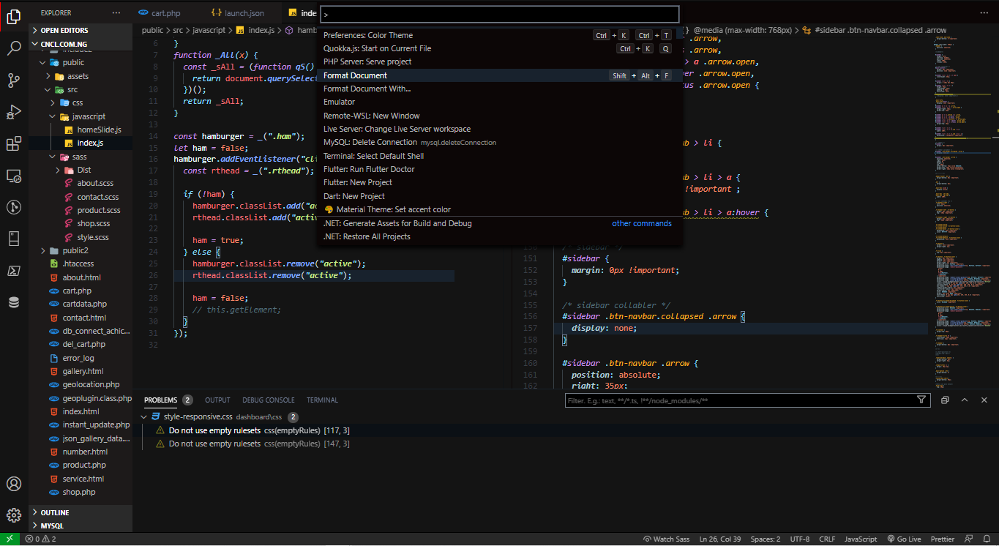

# Decsription

## Mozix-dark_theme.

- Inspired by dark feel of [Mozilla Firefox's](https://addons.mozilla.org/en-US/firefox/addon/dark-theme-for-firefox/) [Dark Theme for Firefox by Stefan vd](https://addons.mozilla.org/en-US/firefox/addon/dark-theme-for-firefox/)

## What do you think About Mozix-dark_theme ??

- I would appreciate suggestions and questions
- Contact me on [Twitter](https://twitter.com/chuddyjoachim)

---

# Installation

---

```
1. Open Extensions sidebar panel in VS Code `View → Extensions`.

2. Search for `Mozix`.

3. Click `Install` to install it.

4. Click `Reload` to reload your editor.

```

## Preview 1.



## Preview 2.


## Preview 3.


## Preview 4.


**Enjoy! the Dark feel**
